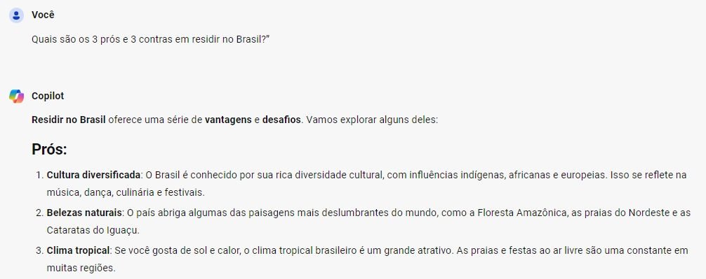
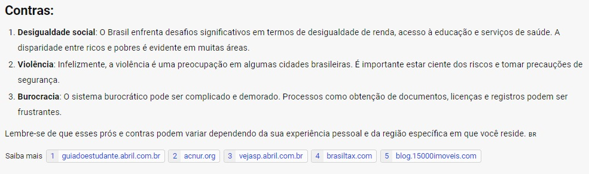
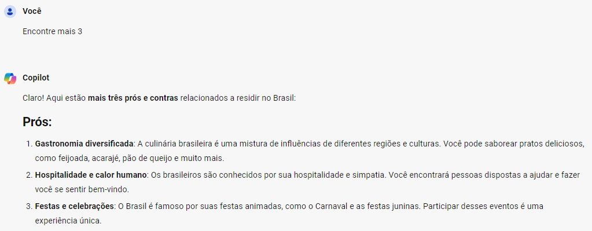
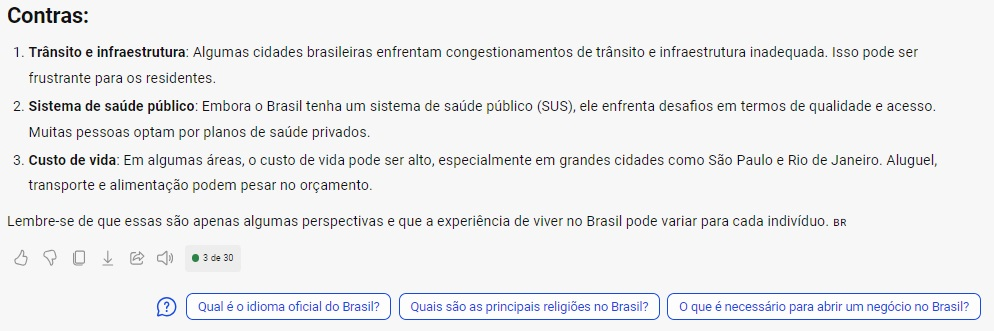
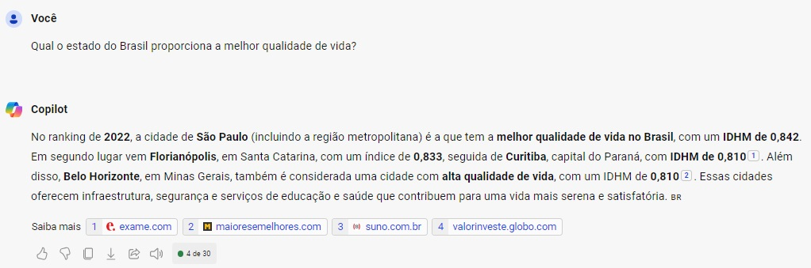
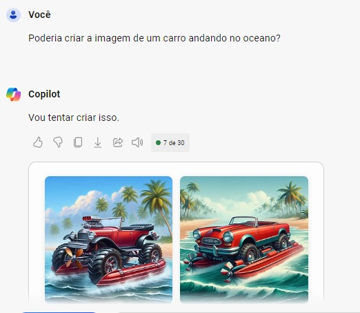
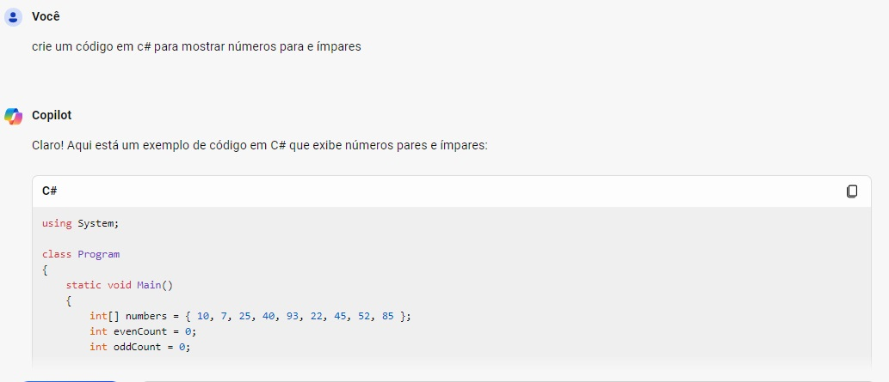
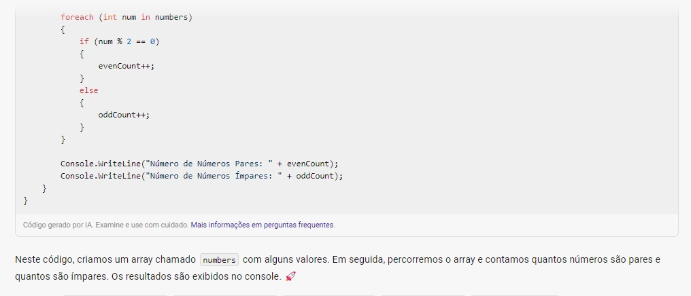
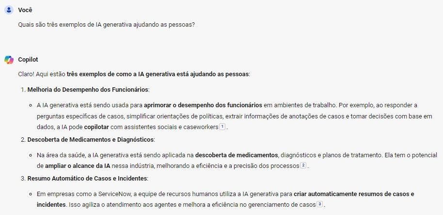

<div style="border: 0px solid #00f; padding: 10px; display: flex; justify-content: center;">
    <div style="box-shadow: 3px 3px 5px #888; display: flex; align-items: center; text-align: center; font-family: 'Verdana', sans-serif;">        
        <h1 style="margin: 0; text-shadow: 2px 2px 3px #888;">Microsoft Azure AI Fundamentals</h1>
    </div>
</div>

<br>
<div style="border: 0px solid #00f; padding: 10px; display: flex; align-items: center; justify-content: center; text-align: center; font-family: 'Lato', sans-serif;">
    <h2 style="margin: 0; text-shadow: 2px 2px 3px #888; font-family: 'Helvetica', sans-serif; text-decoration: none;">
Laboratório: Explorando a IA generativa com o Microsoft Copilot</h2>
</div>
    

<div style="border: 0px solid #00f; padding: 10px; display: flex; align-items: center; justify-content: center; text-align: center;">
    <div style="display: flex; align-items: center; justify-content: center;">
               <h4 style="margin: 0; text-shadow: 2px 2px 3px #888; font-family: 'Raleway', sans-serif;">I ❤️ Front-End Development!</h4>
    </div>
</div>


<h3>Encontre-me :handshake: </h3> 


<p align="center">
    <a href="https://www.linkedin.com/in/renatomoreira-rm/" target="_blank">
        
    </a>
    <a href="https://github.com/RenatoMor" target="_blank">
        
    </a>
    <a href="https://discord.com/channels/@me/1123380010779152444/" target="_blank">
        
    </a>
</a>
    <a href="https://kovihq.slack.com/" target="_blank">
        
    </a>
    <a href="https://www.instagram.com/renatomorspider/" target="_blank">
        
    </a>
    <a href="mailto:piano.tato@gmail.com" target="_blank">
        
    </a>
</p>
</p>
<br>

---

### Menu

- [Descrição :pushpin:](#descrição-pushpin)
- [Como funciona o Microsoft Copilot?](#como-funciona-o-microsoft-copilot)
- [Como usar o Microsoft Copilot?](#como-usar-o-microsoft-copilot)
- [Gerando respostas](#gerando-respostas)
- [Gerando imagens](#gerando-imagens)
- [Criação de código](#criação-de-código)
- [Tarefa bônus :books:](#tarefa-bônus-books)
- [Licença :traffic\_light:](#licença-traffic_light)
- [Agradecimentos :tada:](#agradecimentos-tada)

...

## Descrição :pushpin:

Este é um projeto de exemplo para explorar as capacidades do Microsoft Copilot. O Copilot é uma ferramenta de IA generativa que pode ajudar em várias tarefas, desde a geração de código até a criação de conteúdo criativo. 
    
Neste exercício, você terá a oportunidade de explorar a IA generativa com o Microsoft Copilot. Vamos dar uma olhada em como essa ferramenta pode ajudar a gerar respostas originais com base em modelagem de linguagem natural e informações da web.

## Como funciona o Microsoft Copilot?

O Microsoft Copilot utiliza IA generativa para aprimorar os resultados de pesquisa do Bing. Ao contrário de uma pesquisa tradicional, que retorna conteúdo existente, o Copilot é capaz de criar novas respostas com base em contextos e informações disponíveis na web.

## Como usar o Microsoft Copilot?

1. Faça login no Microsoft Copilot utilizando sua conta pessoal da Microsoft.

2. Na parte inferior da tela, você encontrará uma janela chamada “Pergunte-me qualquer coisa”. Aqui, você pode inserir prompts para obter respostas.
   
3. O Copilot utiliza todo o histórico da conversa para gerar suas respostas. Por exemplo, se você fizer perguntas sobre viagens, ele usará essas informações para criar respostas relevantes.
Exemplo prático: Viagens no inverno
Vamos simular uma série de perguntas sobre viagens no inverno:

## Gerando respostas 

**Morar no Brasil**

**Pergunta:** _“Quais são os 3 prós e contras em residir no Brasil?”_

- O Copilot irá pesquisar e gerar uma resposta com três pontos positivos e negativos em morar no Brasil.




**Pergunta:** _“Encontre mais 3 prós e contras.”_

- Com esse prompt, você está solicitando ao Copilot que liste mais três pontos positivos e negativos em morar no Brasil.




**Região com melhor qualidade de vida**

**Pergunta:** _“Qual o estado do Brasil proporciona a melhor qualidade de vida?”_

- Neste exemplo, o copilot retornou o ranking dos quatro melhores estados do Brasil onde se tem a melhor qualidade de vida.



## Gerando imagens

**Pergunta:** _“Poderia criar a imagem de um carro andando no oceano?”_

- Essa abordagem destaca a eficiência do Copilot em gerar imagens, mesmo diante de solicitações sem sentido. Ele cria imagens com base nas instruções do usuário, demonstrando sua capacidade adaptativa.




## Criação de código

**Solicitação:** _“crie um código em c# para mostrar números para e ímpares?”_

 O copilot pode gerar código útil e funcional com base nas entradas do usuário, economizando tempo e esforço. No entanto, é sempre importante revisar e testar o código gerado para garantir a qualidade e segurança, pois o desempenho pode ser afetado por ambiguidades nas instruções ou falta de contextos específicos.





```Csharp

using System;

class Program
{
    static void Main()
    {
        int[] numbers = { 10, 7, 25, 40, 93, 22, 45, 52, 85 };
        int evenCount = 0;
        int oddCount = 0;

        foreach (int num in numbers)
        {
            if (num % 2 == 0)
            {
                evenCount++;
            }
            else
            {
                oddCount++;
            }
        }

        Console.WriteLine("Número de Números Pares: " + evenCount);
        Console.WriteLine("Número de Números Ímpares: " + oddCount);
    }
}

```
...

## Tarefa bônus :books:

Digite um prompt: Quais são três exemplos de IA generativa ajudando as pessoas?. Você pode usar isso como uma forma de debater suas próprias ideias de copiloto!



---

## Licença :traffic_light:
Este projeto está licenciado sob a Licença consulte o arquivo 
 [MIT](https://opensource.org/licenses/MIT).


## Agradecimentos :tada:

_**Digital Innovation One**_ 

Agradeço à Digital Innovation One por proporcionar recursos educacionais valiosos que contribuíram para o desenvolvimento dos meus projetos.

<a href="https://digitalinnovation.one/" target="_blank">
  
</a>

<br>


_**Azure**_

Expresso minha gratidão à equipe do Microsoft Azure por oferecer uma plataforma robusta e escalável para hospedar e gerenciar aplicativos em nuvem. A eficiência e confiabilidade do Azure são fundamentais para o sucesso de muitos projetos.

[](https://code.visualstudio.com/)

_**VS Code**_

Agradeço à equipe do Visual Studio Code pelo incrível editor que facilita o desenvolvimento deste projeto.

[](https://code.visualstudio.com/)


_**Microsoft**_

Agradeço à equipe da Microsoft por suas contribuições inovadoras para o mundo da tecnologia. Sua dedicação ao desenvolvimento de software e serviços tem impactado positivamente a comunidade global de desenvolvedores.

[](https://www.microsoft.com/pt-br/)

_**GitHub**_ 

Agradeço à equipe do GitHub por fornecer uma plataforma de desenvolvimento colaborativo que facilita o compartilhamento de projetos.

[](https://github.com/RenatoMor)

Copyright © 2024 / RenatoMor


